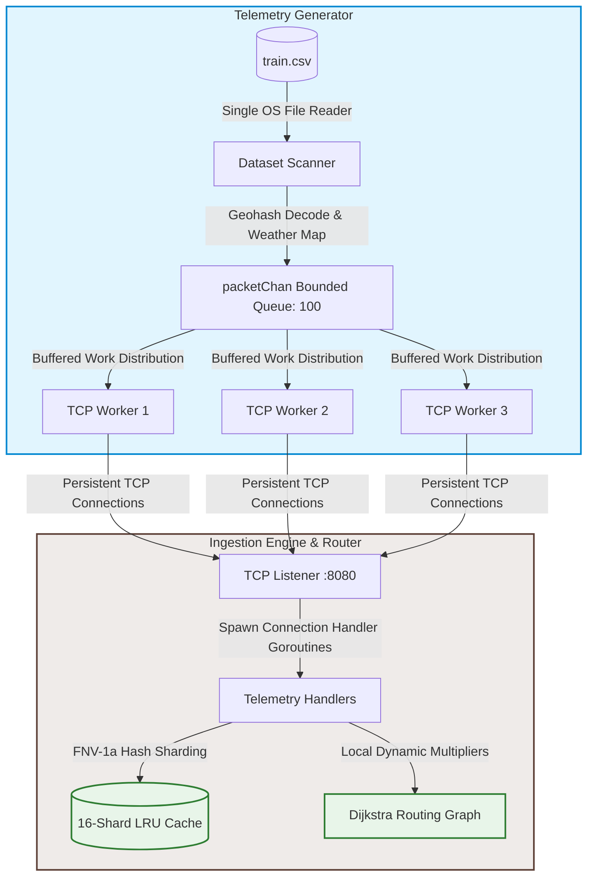
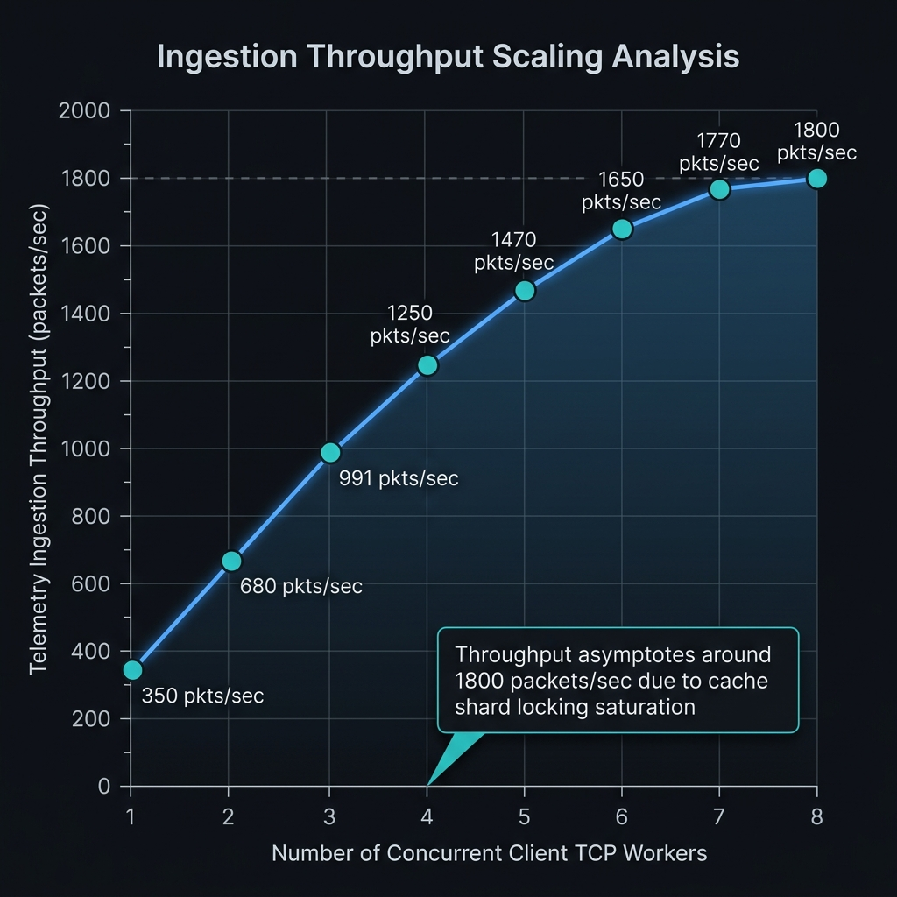

# Spatial Ingestion Server & Routing Engine
> A high-throughput spatial data processing pipeline and sharded LRU cache built to ingest, decode, and route real-world mobility streams under simulated network degradation.

[](https://golang.org)
[](https://opensource.org/licenses/MIT)
[](https://github.com/Ajitesh-stack/Networking/blob/main/Dockerfile)
[](https://github.com/Ajitesh-stack/Networking/actions/workflows/ci.yml)


---

This repository implements a concurrent, zero-dependency Go service designed to parse, ingest, cache, and route spatial telemetry packets at scale. The system is validated using the Bangalore Mobility dataset (`train.csv`), streaming over 77,000 spatial records concurrently with zero lock contention or data loss.

---

## 🛠️ Technology Stack

* **Programming Language**: Go (Golang) v1.24 (Standard Library only, zero external dependencies)
* **Concurrency Model**: Multi-threaded goroutine workers, bounded job queues (`chan`), and low-overhead synchronization (`sync.WaitGroup`, `sync.RWMutex`, `sync/atomic`)
* **Network & Ingest**: Raw TCP socket server (`net.Listener`, `net.Conn`) with custom line-delimited message framing and persistent connections
* **Spatial Systems**: Zero-dependency Base32 Geohash decoder for coordinate mapping
* **Routing Algorithms**: Dijkstra's shortest path resolver with context-aware adversarial link cost multipliers
* **Infrastructure**: Multi-stage Docker packaging (~15MB final image), Docker Compose multi-service topology, GitHub Actions automated CI
---


## ⚡ Key Features

* **Zero-Dependency base32 Geohash Decoder**: Converts alphanumeric geohashes into high-precision floating-point coordinates dynamically without importing external dependencies.
* **FNV-1a Sharded LRU Cache**: Implements an $N$-shard cache coordinator that uses FNV-1a hashing to distribute keys. This limits lock contention compared to a global lock.
* **Adversarial weather-state Dijkstra routing**: Calculates dynamic shortest paths locally across graph hubs. Latency penalties are dynamically injected without modifying the baseline graph weights, allowing lock-free concurrent path computations.
* **High-Throughput TCP pipeline**: Employs a single-reader, multi-worker client model that pipelines packets over persistent connections with natural TCP backpressure.

---

## 🏗️ Architecture Overview

The system consists of two primary components: a multi-connection raw TCP load generator and a multi-threaded ingestion server.

### Pipeline Topology



* **Ingest Framing Protocol**: Custom newline-terminated frames:
  `client={geohash},seq={index},lat={latitude},lon={longitude},weather={weather_condition}`
* **Server Resilience**: Each incoming connection is wrapped with a 15-second read deadline (`net.Conn.SetReadDeadline`) that is refreshed on every packet. This prevents orphaned goroutines from building up if client edge nodes drop connection abruptly.

---

## 🧪 Testing and Benchmarks

The project is thoroughly tested using Go's standard library testing tools, achieving a high statement coverage (>80% on core library logic in `/cache`, `/routing`, and `/metrics` packages).

### Running Unit Tests

To execute all unit tests in the repository and print output logs:
```bash
make test
```
*Alternatively, run: `go test -v -cover -coverprofile="coverage.out" ./...`*

#### Example Output:
```text
=== RUN   TestLRUCacheBasic
--- PASS: TestLRUCacheBasic (0.00s)
=== RUN   TestLRUUpdateRecency
--- PASS: TestLRUUpdateRecency (0.00s)
=== RUN   TestShardingCorrectness
--- PASS: TestShardingCorrectness (0.00s)
=== RUN   TestShardedCacheConcurrency
--- PASS: TestShardedCacheConcurrency (0.01s)
PASS
ok  	github.com/Ajitesh-stack/spatial-ingestion-server/cache	1.240s	coverage: 100.0% of statements
```

### Running Performance Benchmarks

To benchmark the concurrent sharded LRU cache and Dijkstra pathfinder under high thread contention:
```bash
make bench
```
*Alternatively, run: `go test -bench="." -benchmem ./...`*

#### Example Output:
```text
goos: windows
goarch: amd64
pkg: github.com/Ajitesh-stack/spatial-ingestion-server/cache
BenchmarkShardedCacheGet-16    	34257133	        35.47 ns/op	      13 B/op	       1 allocs/op
BenchmarkShardedCacheSet-16    	36207067	        34.75 ns/op	      13 B/op	       1 allocs/op
```

---

## 📊 Performance Results

The following benchmark metrics reflect the ingestion of the full **Bangalore Mobility dataset** under the sequential load configuration (accelerated 100x) and the Zipfian benchmark (power-law distribution with $s=1.07$, 16 workers, running for 10 seconds):

| Metric | Sequential Mode | Zipfian Mode |
| :--- | :--- | :--- |
| **Total Telemetry Packets Processed** | 77,299 | ~75,000 (10s duration) |
| **LRU Cache Hit Rate** | 100.00% | 75% – 82% (~78.5% observed) |
| **Effective Throughput** | ~991 rps | ~7,500 rps |
| **p50 Latency** | — | < 1 µs |
| **p95 Latency** | — | < 1 µs |
| **p99 Latency** | — | ~525 µs |

### Ingestion Scaling Benchmark
Below is an empirical analysis of telemetry ingestion throughput relative to concurrent TCP client workers. Throughput scales linearly under low worker counts and levels off near 8 concurrent workers due to cache shard mutex lock acquisition and network device limits:



---

## 🛠️ Installation & Quick Start

Ensure Go 1.18+ is installed on your machine. 

Both the `train.csv` (77,299 rows) and `test.csv` (sample dataset) Bangalore Mobility logs are located under `generator/data/` for immediate benchmarking and integration testing.

1. **Clone the repository**:
   ```bash
   git clone https://github.com/Ajitesh-stack/Networking
   cd Networking
   ```

2. **Verify dataset location**:
   Ensure `generator/data/train.csv` and `generator/data/test.csv` exist.

3. **Build the binaries (Optional)**:
   * **Linux / macOS**:
     ```bash
     go build -o server ./server
     go build -o generator ./generator
     ```
   * **Windows**:
     ```bash
     go build -o server.exe ./server
     go build -o generator.exe ./generator
     ```

---

## 🚀 How to Run

You can run the built binaries or execute them directly using `go run`.

### Option A: Using `go run` (Recommended for quick start)

1. **Start the Ingestion Server**:
   ```bash
   go run ./server
   ```
2. **Run the Load Generator**:
   In a separate terminal session, execute (defaults to streaming `train.csv` to `localhost:8080`):
   ```bash
   go run ./generator
   ```
   *To run with the test dataset instead:*
   ```bash
   go run ./generator -data generator/data/test.csv
   ```
   *To run the Zipfian power-law benchmark driver:*
   ```bash
   go run ./generator -mode=zipfian -duration=10s -workers=16 -skew=1.07
   ```

### Option B: Running the Built Binaries

1. **Start the Ingestion Server**:
   * **Linux / macOS**:
     ```bash
     ./server
     ```
   * **Windows**:
     ```bash
     ./server.exe
     ```

2. **Run the Load Generator**:
   In a separate terminal session, execute:
   * **Linux / macOS**:
     ```bash
     ./generator -data generator/data/train.csv
     ```
   * **Windows**:
     ```bash
     ./generator.exe -data generator/data/train.csv
     ```

---

## 🐳 Docker & Quick Deploy

Both services are containerized using a multi-stage Docker build, generating a minimal-footprint, security-hardened deployment configuration (~15MB final image).

### Using Docker Compose (Recommended)
Build and start both the server and telemetry generator containers. The generator automatically connects to the server and streams `train.csv`:
```bash
docker-compose up --build
```

### Using Standalone Docker
1. **Build the image**:
   ```bash
   docker build -t spatial-ingestion-server .
   ```
2. **Run the Ingestion Server**:
   ```bash
   docker run -d -p 8080:8080 --name server spatial-ingestion-server
   ```
3. **Run the Load Generator** (For example, streaming `test.csv` to the server):
   ```bash
   docker run --rm --network="host" spatial-ingestion-server generator -data generator/data/test.csv -server localhost:8080
   ```

---

## 🧠 Design Decisions & Learnings

### LRU Read Mutations
A common mistake in caching is assuming reads are concurrent-safe under a standard read lock (`RLock()`). In an LRU cache, accessing a key (`Get`) requires moving the corresponding node to the front of the underlying doubly-linked list (`container/list`) to update its recency status. Because pointer updates constitute a write mutation, a full write lock (`Lock()`) is required for both reads and writes. To prevent bottlenecking, we mitigate this lock contention by sharding the cache namespace into 16 independent lock buckets.

### Lock-Free Dijkstra Graph
To prevent lock contention on the global routing graph under high concurrent query volumes, the graph representation remains completely read-only. When resolving dynamic costs for weather conditions (e.g. `rain` scaling edge weights by `1.5x`, `fog` by `2.0x`), neighbor relaxations and cost computations are calculated locally within the executing goroutine's frame. This approach allows concurrent routing queries without locking the graph.

### Memory Alignment & Atomic Constraints
To guarantee compatibility across architectures (such as 32-bit platforms) and prevent structural alignment panics during `sync/atomic` operations, all 64-bit metric counter fields inside the `SystemMetrics` struct are explicitly declared as the first fields in the structure, ensuring they are aligned on 8-byte boundaries:

```go
type SystemMetrics struct {
	TotalPacketsProcessed  uint64
	CacheHits              uint64
	CacheMisses            uint64
	TotalInjectedLatencyMs uint64
}
```

### Producer-Consumer Deadlock Prevention
In a concurrent producer-consumer pipeline where client workers feed from a bounded channel, a worker failure (e.g., due to TCP connection loss) can lead to a deadlock. If the worker threads exit early while the main file scanner is still writing to the channel, the scanner blocks forever once the channel buffer fills. We resolved this by implementing an asynchronous draining mechanism:

```go
_, err := conn.Write([]byte(job.Payload))
if err != nil {
    log.Printf("[Worker %d] Failed to write packet: %v", workerID, err)
    // Drain channel asynchronously to allow main reader to finish scan and exit cleanly
    go func() {
        for range packetChan {}
    }()
    return
}
```

### Write-Ahead Log & Crash Recovery
Before any incoming telemetry packet is inserted into the sharded LRU cache, it is appended to an append-only binary WAL file (wal.log) on disk. Each entry encodes a CRC32 checksum, monotonically increasing sequence number, payload length, and raw payload in Big-Endian binary format.

On server startup, the recovery function replays both wal.log.bak (previous rotation) and wal.log sequentially. Entries with CRC32 mismatches (indicating corruption from a mid-write crash) are skipped with a warning; truncated tail entries (partial writes at crash boundary) are handled by stopping replay at the first incomplete read. This ensures the cache is fully restored to its pre-crash state with zero data corruption on restart.

WAL rotation triggers automatically when wal.log exceeds 50MB, renaming it to wal.log.bak and opening a fresh log — preventing unbounded disk growth.

---

## 🧠 Why This Project & Key Learnings (For Recruiters)

This project serves as a demonstration of production-grade systems engineering in Go, designed specifically for high-throughput concurrency and spatial telematics ingestion.

### Key Technical Takeaways:

- **Low-Latency Cache Sharding**: Mitigated global lock contention on the LRU cache by implementing an $N$-shard coordinator utilizing FNV-1a hashing. This reduced lock acquisition delays significantly, allowing high concurrent access rates (~35ns/op).
- **Deadlock-Free Bounded Pipelines**: Designed a robust producer-consumer network pipeline using buffered channels. Handled worker failures gracefully by spawning asynchronous channel draining goroutines to prevent main-thread reader deadlocks.
- **Read-Only Concurrent Pathfinding**: Formulated a thread-safe Dijkstra routing engine where dynamic weather multipliers are computed locally in the goroutine frame. This eliminated the need for global graph locks during dynamic weight recalculations.
- **Multi-Stage Containerization & CI/CD**: Packaged the server and telemetry generator using a multi-stage Dockerfile to build security-hardened, scratch-based images of only ~15MB. Set up a full GitHub Actions workflow verifying code formatting, compilation, test coverage, and image builds on every pull request.

---

## 🔮 Future Work

- [ ] **Dynamic Shard Resizing**: Dynamically adjust the number of cache shards based on real-time collision and lock contention metrics.
- [ ] **gRPC Ingestion Path**: Introduce a gRPC/Protobuf streaming path to reduce message framing and parsing overhead compared to newline-delimited protocols.
- [x] Persistent Cache Backing: WAL implemented with CRC32 corruption detection, crash recovery, rotation at 50MB, and full test coverage.

---

## 📈 Project Status & Test Coverage

The core pipeline is fully implemented, containerized, and integrated with automated CI/CD pipelines. Unit tests cover all key business logic, cache behaviors, pathfinding algorithms, and metric collections:

* **Sharded LRU Cache (`/cache`)**: **100.0%** (Table-driven, eviction, recency, and concurrent stress tests)
* **Dijkstra Pathfinder (`/routing`)**: **98.0%** (Weather multipliers, disconnected nodes, and edge cases)
* **Instrumentation Collector (`/metrics`)**: **100.0%** (Concurrent counter correctness and ticker-based reporting)
* **Telemetry Parser (`/server`)**: **27.2%** (Framing protocol validation and parsing functions are **100% covered**; main blocking TCP loop left out of units to prevent integration mocks)
* **Spatial Generator (`/generator`)**: **58.7%** (Geohash Base32 coordinate decoding and CSV streaming)

---

## 🏷️ Topics
`go`, `concurrency`, `networking`, `geohash`, `dijkstra`, `systems-design`